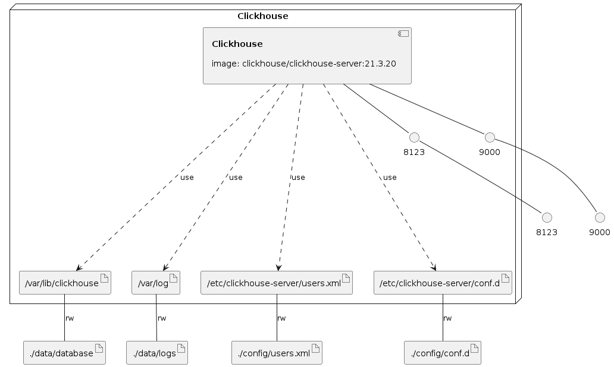

# docker-compose
docker-compose redis、mysql、elasticsearch、kafka、clickhouse

## [Elasticsearch](./elasticsearch)
## [Kibana](./kibana)
## [Clickhouse](./clickhouse)
## [Kafka](./kafka)
## [Kafka-kwol](./kafka-kowl)
## [Nginx](./nginx)
## [Mysql](./mysql)
## [Redis](./redis)

https://blog.csdn.net/weixin_30306905/article/details/96993216

### Infrastructure model

